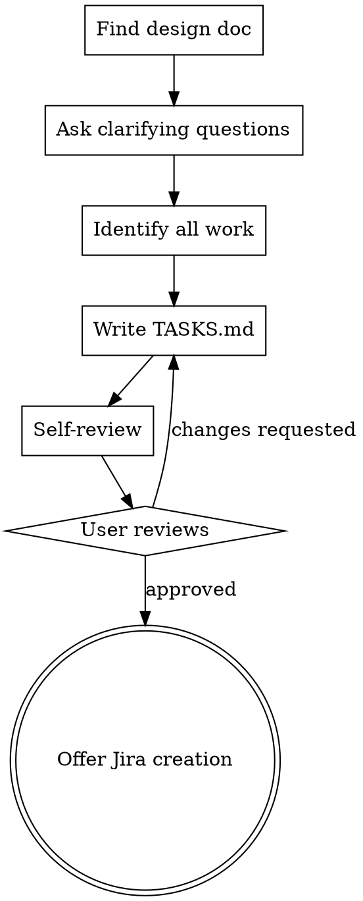

# Project Sprint Planning

Turn an approved design document into an atomic, estimated, dependency-mapped task breakdown ready for ticketing.

## When to Use

- A design doc exists and has been reviewed/approved
- The next step is creating sprint tickets, not writing code
- You need estimates, dependencies, and a critical path

**Not for:** developer implementation plans (use `writing-plans`), or when no design doc exists (use `superpowers:brainstorming` first).

## Process



### Step 1: Find the design doc

Look for `DESIGN.md` in the current project directory. If there are multiple or none, ask the user which document to use before proceeding.

A well-formed `DESIGN.md` should contain: problem statement, proposed solution/architecture, data flows or schemas, infrastructure components, and any external dependencies or access requirements. If the design doc is missing these sections, note what's absent and ask the user to fill in any gaps before proceeding — incomplete design docs produce incomplete task breakdowns.

### Step 2: Ask clarifying questions (one at a time)

- **Sprint length** — default: 2 weeks
- **Developer profile** — default: single senior developer familiar with the stack
- If either default is wrong, adjust estimates accordingly before writing tasks.

### Step 3: Identify ALL work

Split work into two categories:

**Engineering tasks:**
- Application code and unit tests
- Infrastructure / Terraform
- Container/build setup
- Integration and end-to-end validation

**Non-engineering / paperwork tasks** — always check for these explicitly:
- API keys or tokens that need to be provisioned by a third party
- Cloud project permissions, service account requests
- Secret Manager or credential storage setup
- Security or compliance reviews
- External service accounts (SaaS, vendor portals)
- CI/CD pipeline setup or approvals
- DNS, firewall, or network change requests
- Spacelift/Atlantis stack registration

Ask the user: *"Are there any other access requests or approvals needed that aren't obvious from the design?"*

### Step 4: Write tasks

For each task:
- **Title:** imperative, specific (e.g., "Write Fastly API client with unit tests")
- **Description:** what done looks like, including any deliverables or commands
- **Story points:** assign using the scale below
- **Depends on:** list of task IDs that must complete first

#### Story Point Scale

| Points | Hours | Effort | Complexity | Risk |
|---|---|---|---|---|
| 1 | ≤4h | X-small | Short task, can be done alone, has required clarity | Low to none |
| 3 | 8–16h | Small | Default starting point | Slight chance of side effects |
| 5 | 24–32h | Medium | May involve coordinating with another team or waiting on a support ticket | Medium — touching key systems or shared components |
| 8 | 40–56h | Large | Coordinating with multiple teams; getting approvals | High — requires extra testing, rollback plan |
| 13 | 64–80h | X-large | Significant effort and/or complexity; approaches a full sprint | Significant — can block others |
| 20 | — | Too large | Must be broken down before it can be estimated or assigned | — |

Any task scoring 20 must be split before TASKS.md is written. No 20-point tasks in the final document.

### Step 5: Write TASKS.md

Save to the project directory alongside `DESIGN.md`. Use this exact format for each task section — the `create-jira-tickets` skill parses this structure, so consistency matters:

```
### TASK-N: <imperative title>
**Story points:** N (Xh)

<full description — what done looks like, deliverables, commands>

**Depends on:** TASK-X, TASK-Y
```

- Omit the `**Depends on:**` line entirely if the task has no dependencies (don't write "Depends on: —")
- Story points format must be `**Story points:** N (Xh)` — e.g., `**Story points:** 3 (8–16h)`
- Task IDs must be sequential integers: `TASK-1`, `TASK-2`, etc.

After all task sections, include:
- A summary table with columns: Task ID, Description, Points, Hours, Depends On
- Critical path called out explicitly (longest dependency chain)
- Total estimate

### Step 6: Self-review before showing the user

Check:
- [ ] Every task is atomic (one person, one sprint window max)
- [ ] No two tasks cover overlapping work
- [ ] All dependencies are explicit and acyclic
- [ ] All paperwork tasks are present — credentials, access, reviews
- [ ] Story points assigned using the scale above; no task is 20 points
- [ ] Estimates are realistic for the stated developer profile
- [ ] Critical path is correctly identified

Fix any issues, then present to the user.

### Step 7: User review gate

> "TASKS.md written to `<path>`. Please review and let me know if you want changes before we create tickets."

Wait for approval. Make any requested changes and re-run self-review.

### Step 8: Offer Jira creation

Once approved:

> "Ready to create Jira tickets from this breakdown? If so, I'll use the `create-jira-tickets` skill. It will ask a few questions — project key, whether to link to an existing epic or create a new one, whether these should be subtasks of an existing issue, and optional sprint/assignee."

If the user says yes, invoke `create-jira-tickets`.

## Common Mistakes

- **Missing paperwork tasks** — credential provisioning and access requests are always there; look harder
- **Tasks too large** — anything scoring 20 points must be split; anything at 13 should be scrutinized
- **Implicit dependencies** — if task B needs output from task A, say so explicitly
- **Skipping the review gate** — always wait for user approval before offering Jira creation
