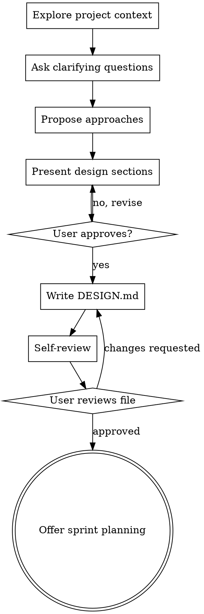

# Write Design Doc

Turn an idea into a structured `DESIGN.md` ready for `project-sprint-planning`.

## When to Use

- A user has an idea, feature request, or problem to solve and needs a design doc
- No `DESIGN.md` exists yet (or the existing one is too vague to plan from)
- The next step after this skill is `project-sprint-planning`

**Not for:** projects that already have an approved design doc (go straight to `project-sprint-planning`), or developer implementation plans (use `writing-plans`).

<HARD-GATE>
Do NOT write DESIGN.md until you have presented the full design to the user and received explicit approval. Premature writing wastes time if the design needs revision.
</HARD-GATE>

## Process



### Step 1: Explore project context

Before asking anything, read the project directory: existing docs, README, recent code structure, any partial specs. Also look for sample data files — API response fixtures, example payloads, CSV samples, or anything named `sample`, `example`, `fixture`, or `mock`. These are often the most concrete artifact available early in a project and directly inform schemas, field names, and data flows.

If you find sample data, note what it tells you (field names, types, nesting, cardinality) and reference it when presenting the Data Flows section — don't ask the user to re-describe what a file already shows.

If the project involves an external API and you can identify the service or endpoint (from the README, existing code, or config), fetch the API documentation directly using web search or the provided URL. Extract response schemas, field descriptions, and pagination behavior. Use this to pre-populate the Data Flows section rather than asking the user to describe fields the docs already define. Note the doc source in DESIGN.md so it can be referenced later.

If you find an existing partial design doc, summarize what's already captured and ask the user if they want to build on it or start fresh.

### Step 2: Ask clarifying questions

Ask **one question at a time**. Prefer multiple-choice questions where reasonable; open-ended is fine for unconstrained topics. Do not combine questions.

Cover these areas in order — skip any that the project context already answers:

1. **Problem / motivation** — What problem does this solve, and for whom? What's the trigger for building it now?
2. **Scope** — What is explicitly in scope? What is out of scope for this iteration?
3. **Success criteria** — How will you know this is working correctly?
4. **Users / consumers** — Who or what calls or uses this system (humans, services, scheduled jobs)?
5. **Sample data** — Only ask this if Step 1 found neither sample files nor fetchable API docs. "Do you have any API response samples or example payloads? If not, can you make a real call and capture one before we finalize the schema?" Skip this question entirely if the schema is already known from docs or fixtures.
6. **Data** — What data flows in and out? What gets stored, where, and in what shape? (If sample data was provided, anchor this answer to what the sample shows rather than re-describing it.)
7. **Infrastructure** — Where does this run (Cloud Run, GKE, Lambda, etc.)? What existing infrastructure does it touch?
8. **External dependencies** — Are there third-party APIs, SaaS services, or vendor portals involved? Any access or credentials that need to be provisioned?
9. **Constraints** — Any hard requirements around latency, cost, compliance, existing tech choices, or team conventions?

If scope seems too large (multiple independent subsystems), flag it before going deeper:

> "This sounds like it might decompose into [X], [Y], and [Z] as separate pieces. Should we design them together or focus on one at a time?"

### Step 3: Propose 2–3 approaches

Once you understand what's being built, propose 2–3 different approaches. For each:
- Describe the approach in 2–3 sentences
- List the key trade-offs (complexity, cost, operational burden, flexibility)
- State your recommendation and why

Lead with your recommended option. Get the user's sign-off on direction before presenting the full design.

### Step 4: Present design sections

Present the design incrementally — one section at a time. Ask "Does this look right?" after each section before moving to the next. Be ready to revise.

Sections to cover (scale each to its complexity — a sentence if straightforward, a paragraph if nuanced):

1. **Problem Statement** — the problem, who it affects, and why now
2. **Proposed Solution** — the chosen approach and what it delivers
3. **Architecture & Components** — the parts of the system, what each does, how they connect
4. **Data Flows** — how data moves through the system; include schemas or field lists for stored data
5. **Infrastructure** — compute, storage, networking, scheduling; reference existing project infrastructure where applicable
6. **External Dependencies & Access Requirements** — third-party APIs, credentials, service accounts, vendor portals, and anything that requires a provisioning step before work can begin

### Step 5: Write DESIGN.md

Once the user approves the full design, write `DESIGN.md` to the project root using this structure:

```markdown
# <Project Name> — Design

_Date: YYYY-MM-DD_

## Problem Statement

<Why this exists and what it solves>

## Proposed Solution

<What we're building and the key decision made in Step 3>

## Architecture & Components

<System parts, responsibilities, and how they connect>

## Data Flows

<How data moves through the system; schemas or field lists for stored data>

## Infrastructure

<Compute, storage, networking, scheduling; reference existing infrastructure>

## External Dependencies & Access Requirements

<Third-party APIs, credentials, service accounts, vendor portals, provisioning steps>
```

All six sections are required. Write "None" in a section only if it genuinely does not apply.

### Step 6: Self-review

Before showing the user, check:
- [ ] All six sections are present and non-empty
- [ ] No "TBD", "TODO", or placeholder text
- [ ] No contradictions between sections
- [ ] External dependencies section captures everything that requires a provisioning action (not just code)
- [ ] Data flows section includes field-level detail for anything being stored
- [ ] A reader unfamiliar with the project could understand what's being built and why

Fix any issues, then present to the user.

### Step 7: User review gate

> "DESIGN.md written to `<path>`. Please review it and let me know if you want any changes before we move to sprint planning."

Wait for approval. Make any requested changes and re-run the self-review checklist.

### Step 8: Offer sprint planning

Once approved:

> "Ready to break this into sprint tasks? I'll use the `project-sprint-planning` skill — it will read DESIGN.md and produce an estimated, dependency-mapped task breakdown."

If the user says yes, invoke `project-sprint-planning`.

## Key Principles

- **One question at a time** — never ask two questions in one message
- **Multiple choice preferred** — easier to answer than open-ended when the options are knowable
- **YAGNI** — remove nice-to-haves from the design; scope to what's being built now
- **Explore alternatives** — always propose 2–3 approaches before committing
- **External dependencies are first-class** — provisioning delays kill sprints; capture everything that needs human action before code can run
- **Don't write until approved** — the hard gate exists because revising a written doc is slower than revising a described one

## Common Mistakes

- **Skipping the context exploration** — reading the project first prevents redundant questions
- **Asking multiple questions at once** — breaks the collaborative rhythm and produces worse answers
- **Ignoring sample data** — if a response fixture or example payload exists in the project, use it; don't ask the user to describe fields that a file already shows
- **Not fetching API docs** — if the external API is identifiable, fetch the docs before asking the user anything; don't make the user transcribe what the docs already say
- **Finalizing schemas without samples** — if no sample or docs exist and the system talks to an external API, ask if the user can capture a real response before locking in the schema; guessed field names cause rework
- **Vague data flows** — "data goes to BigQuery" is not enough; name the tables and fields; if a sample exists, derive field names directly from it
- **Missing access requirements** — API keys, service accounts, and vendor approvals take calendar time; they must appear in the design so `project-sprint-planning` surfaces them as paperwork tasks
- **Writing before approval** — revising a written doc mid-session is wasteful; get verbal approval first
